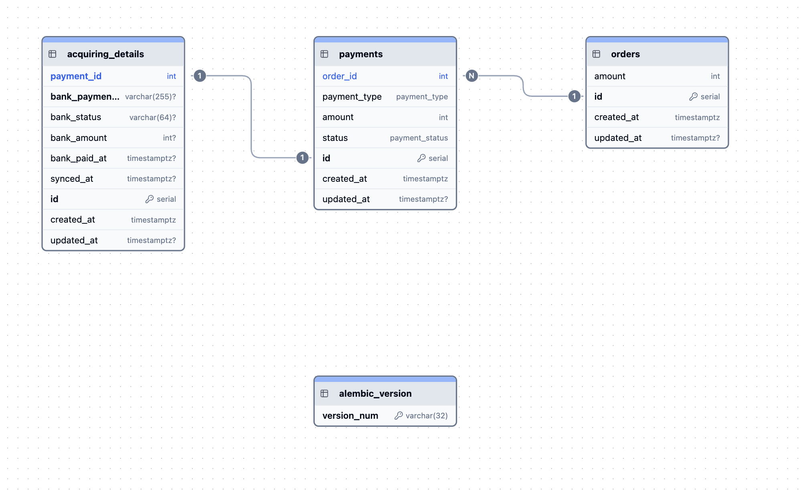

# Сервис работы с платежами по заказу

Проект реализует сервис управления платежами для заказов с поддержкой:

Эквайринг с банком реализован в тестах, по причине того, что это внешний сервис. 
В АПИ реализован рабочий вариант с наличными

## Стурктура
```
|-api/ - вьюхи
|-conf/ - конфигурация проекта
|-core/ - ядро
|-exceptions/ - исключения
|-models/ - модели
|-repositories/ - репозитории
|-schemas/ - сериализаторы
|-services/ - бизнес-логика
|-tests/ - тесты
```

## компоненты

- `app/services/payment_service.py` — бизнес-логика создания платежей и возвратов
- `app/services/bank_client.py` — HTTP-клиент для общения с банком-эквайером
- `app/models/payment.py` — модель платежа и связь с заказом
- `tests/test_payments.py` — интеграционные тесты с PostgreSQL

## Запуск

```
docker compose run --rm migrate
docker compose up
```

## Запуск тестов

Проект собрал в docker-compose. Тесты запускаются через Docker Compose и используют PostgreSQL для обкатки:

```bash
docker compose run --rm test
```

## Схема базы



В качестве денежных средств выбрано поле INT, а по хорошему лучше BIGINT

Нет ошибок округления
Быстрее вычисления
Проще агрегаты

В данном кейсе считаю это уместным решением. 
В отличие от биллинга, где могут расчеты вычисляться до 6-7 знаком после запятой в копейках. Например в расходах LLM токенах